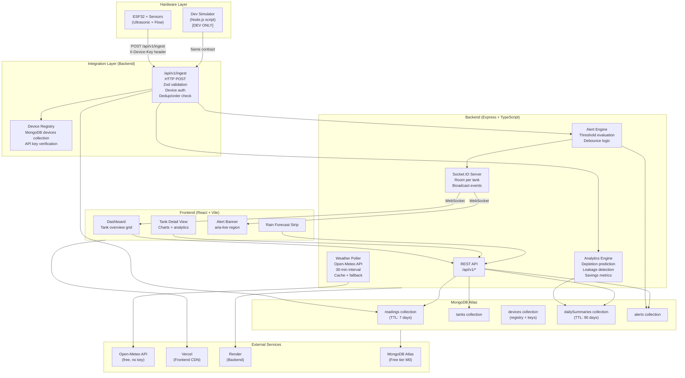

# AquaSave: Smart Rainwater Harvesting Management System
## Hackathon MVP — TASK.md

---

# Executive Summary

AquaSave is a real-time rainwater harvesting management system built for a 24-hour hackathon. It bridges physical hardware (ESP32 + sensors) with a polished web dashboard to deliver actionable water-usage intelligence. The MVP demonstrates live tank monitoring, historical consumption analytics, predictive depletion alerts, and leakage detection — all backed by a production-quality integration layer that accepts real ESP32 hardware with zero code changes.

The system is scoped to win on three dimensions: technical depth (real hardware integration, analytics algorithms, realtime infrastructure), product polish (SCADA-inspired UI, meaningful data visualization), and demo reliability (simulator fallback, graceful degradation, rehearsed flow).

**Team split:** Hardware team owns ESP32 firmware and physical prototype. Software team owns everything in this document. Integration handoff occurs at Hour 10, Hour 16, and Hour 20 checkpoints.

---

# Problem Understanding

Residential and agricultural rainwater harvesting systems are largely unmonitored. Users have no visibility into:

- Current tank fill levels across multiple tanks
- Whether consumption is on track or trending toward depletion
- Whether a slow leak is silently wasting stored water
- Whether rain is coming, making an early-draw decision safe or risky

Existing solutions are either expensive SCADA systems (overkill for small installations) or manual dipstick checks (unreliable, infrequent). AquaSave targets the gap: a civic-tech-grade monitoring platform that runs on commodity hardware (ESP32 + ultrasonic sensor) and a free cloud tier, making it deployable for under $20 in hardware costs.

**Core insight for judges:** The problem is real, the hardware is cheap, the software is non-trivial. The demo shows a physical sensor changing a live dashboard value. That is the wow moment.

---

# Scope Management

### In Scope (24 hours)

| Priority | Feature |
|----------|---------|
| P0 | Real-time tank level monitoring (live %) |
| P0 | Live dashboard with multi-tank overview |
| P0 | Historical usage tracking (time-series charts) |
| P0 | Low-water threshold alerts (push + in-app) |
| P0 | Multi-tank support (up to 4 tanks in demo) |
| P0 | Sensor data ingestion endpoint |
| P0 | Consumption analytics (daily/weekly volume) |
| P1 | Depletion prediction (hours-to-empty) |
| P1 | Leakage detection (rule-based) |
| P1 | Water-savings metrics vs. municipal baseline |
| P1 | Rain forecast awareness (Open-Meteo API) |
| P2 | Authentication (JWT, bcrypt) |
| P2 | Role management (viewer/admin) |
| P2 | Admin dashboard |

### Out of Scope

- Mobile app
- Multi-tenant / multi-property
- Billing or payment
- OTA firmware updates
- Historical data export (CSV/PDF)
- Map view / GIS layer
- Third-party integrations beyond weather API

### Scope Guardrails

If a feature is not listed above, it does not exist in this sprint. Any team member who starts building something not on this list must call a 5-minute scope review. The PM role (software lead) has final say.

---

# Hackathon Success Criteria

A winning MVP must satisfy all of the following by demo time:

1. **Hardware live:** At least one real ESP32 device posts data and the dashboard reflects it in < 2 seconds.
2. **Dashboard loads in < 3 seconds** on a cold Vercel deployment.
3. **All P0 features are functional** and demonstrable without crashes.
4. **At least two P1 features** are functional (depletion prediction + leakage detection preferred).
5. **No hardcoded sensor data** appears in any production code path.
6. **Alerts fire** when a tank level drops below threshold, visible in the UI within 5 seconds.
7. **The demo script runs end-to-end** without manual intervention in a dry run before presentation.
8. **Judges can ask "what if the sensor goes offline?"** and the UI shows an offline badge without crashing.
9. **Code is on GitHub** with a readable README and at least one meaningful commit per major feature.
10. **The UI does not look like a default template.** Every screen has intentional design decisions a judge can comment on.

---

# Functional Requirements

### FR-01: Sensor Data Ingestion
- The backend MUST accept POST requests at `/api/v1/ingest` with the hardware payload contract.
- The backend MUST validate the payload against the contract schema (Zod).
- The backend MUST reject payloads with unknown `deviceId` values (device registry check).
- The backend MUST reject payloads with invalid API keys (per-device key in header).
- The backend MUST handle duplicate packets (idempotency by deviceId + timestamp).
- The backend MUST handle out-of-order packets (discard if timestamp < last stored).
- The backend MUST detect stale devices (no reading in configurable window, default 5 min).

### FR-02: Real-Time Dashboard
- The frontend MUST display current water level (%) for each registered tank.
- The frontend MUST update without page refresh when new sensor data arrives.
- The frontend MUST show tank status: Normal (>40%), Low (15–40%), Critical (<15%), Offline (stale).
- The frontend MUST display flow rate (L/min) and last-seen timestamp per tank.

### FR-03: Historical Usage Tracking
- The backend MUST store all sensor readings with timestamps.
- The frontend MUST display a time-series chart for level and flow rate per tank.
- Chart time ranges: Last 1 hour, 6 hours, 24 hours, 7 days (selectable).

### FR-04: Alerts
- The backend MUST evaluate thresholds on each ingested reading.
- The backend MUST emit a Socket.IO alert event when level crosses Low or Critical threshold.
- The frontend MUST display an in-app alert banner with tank name, level, and timestamp.
- Alerts MUST use `aria-live="assertive"` for accessibility.
- The same alert threshold must not re-fire more than once per 15-minute window per tank.

### FR-05: Multi-Tank Support
- The system MUST support up to 4 tanks in the demo configuration.
- Each tank is identified by a unique `deviceId` registered in the device registry.
- The dashboard MUST show all tanks in a scannable overview grid.

### FR-06: Consumption Analytics
- The backend MUST compute daily consumption volume (L) from flow sensor readings via numerical integration (trapezoidal approximation over the reading interval).
- The frontend MUST display a bar chart of daily consumption for the last 7 days.
- The frontend MUST display total volume consumed this week vs. last week.

### FR-07: Depletion Prediction (P1)
- The backend MUST compute a rolling 1-hour consumption rate (L/hr) using the last N readings.
- The backend MUST compute estimated hours-to-empty = currentVolume / rollingRate.
- The frontend MUST display predicted empty time as a human-readable label ("~6 hrs", "~2 days").
- If rollingRate ≤ 0 (tank filling), prediction displays "Filling" instead.

### FR-08: Leakage Detection (P1)
- The backend MUST flag a potential leak when: flow rate > 0.5 L/min AND level has not changed by more than 1% over the last 10 consecutive readings.
- The backend MUST flag a potential leak when: non-zero flow rate is detected during a configurable quiet-hours window (default: 00:00–05:00 local time) for 3 consecutive readings.
- Leakage flags MUST be stored per tank and surfaced as a banner alert in the UI.

### FR-09: Water Savings Metrics (P1)
- The backend MUST store a `municipalRatePerLiter` config value per installation (default: 0.003 USD/L, editable).
- The frontend MUST display estimated savings = totalHarvestedVolume × municipalRatePerLiter.
- The frontend MUST display CO₂ equivalent saved = totalHarvestedVolume × 0.000298 kg CO₂/L (IPCC default).

### FR-10: Rain Forecast Awareness (P1)
- The backend MUST fetch rain forecast from Open-Meteo API (`/v1/forecast?hourly=precipitation`) on a 30-minute polling interval.
- The backend MUST cache the last successful response and serve it on failure (graceful fallback).
- The frontend MUST display a 24-hour rain forecast strip with precipitation probability bars.
- When precipitation > 5mm is forecast in the next 6 hours, the UI MUST show a "Rain incoming — consider conserving" advisory.

---

# Non-Functional Requirements

| Category | Requirement |
|----------|-------------|
| **Performance** | Dashboard initial load < 3s on a 10 Mbps connection |
| **Realtime latency** | Sensor reading → UI update < 2s end-to-end |
| **Availability** | Backend uptime ≥ 99% during demo window (Render free tier is acceptable) |
| **Data retention** | Raw readings retained for 7 days (TTL index); aggregated daily summaries retained for 90 days |
| **Scalability** | Not a requirement. System is sized for ≤ 10 devices and ≤ 100 req/min |
| **Security** | Per-device API keys in `X-Device-Key` header; keys stored hashed (SHA-256) in DB; no plaintext secrets in VCS |
| **Reliability** | Hardware simulator produces identical behavior to real device; UI degrades gracefully when backend is unreachable |
| **Accessibility** | WCAG 2.1 AA color contrast; keyboard navigable; aria-live regions for alerts; no color-only status cues |
| **Browser support** | Chrome 120+, Firefox 120+, Safari 17+ |
| **Code quality** | ESLint + Prettier enforced on commit (lint-staged + Husky); TypeScript strict mode; no `any` in production paths |
| **Observability** | Structured JSON logs on backend (pino); error boundaries on all React route components |

---

# Architecture Diagram (Mermaid)



---

# Data Flow

### Ingest Path (Happy Path)

```
ESP32 →
  POST /api/v1/ingest { deviceId, waterLevel, flowRate, timestamp }
  Header: X-Device-Key: <device-api-key>
  ↓
  [Auth Middleware] Hash key → lookup devices collection → reject if not found
  ↓
  [Zod Validation] Schema check → reject with 422 if invalid
  ↓
  [Dedup Check] Query readings for (deviceId, timestamp) → skip if exists (202)
  ↓
  [Order Check] Compare timestamp to lastReadingAt in devices → discard if older
  ↓
  [Unit Normalization] waterLevel: integer 0–100 (%), flowRate: float L/min
  ↓
  [Write] Insert into readings collection
  ↓
  [Update] devices.lastReadingAt, devices.lastLevel, devices.lastFlowRate
  ↓
  [Analytics] Compute rollingRate, depletionHours, leakageFlag (sync, in-process)
  ↓
  [Alert Engine] Evaluate thresholds → if triggered and not debounced → insert alert
  ↓
  [Socket.IO] Emit 'reading:new' to room `tank:${deviceId}`
             Emit 'alert:new' to room `tank:${deviceId}` if alert fired
  ↓
  Response: 201 Created
```

### Frontend Realtime Path

```
Browser connects Socket.IO →
  Joins room 'tank:all' (overview) and 'tank:{id}' (detail page)
  ↓
  On 'reading:new': update tank card level/flow/timestamp (React state)
  ↓
  On 'alert:new': push to alert queue → render banner → announce via aria-live
  ↓
  On disconnect: show "Reconnecting..." overlay (Socket.IO auto-reconnect)
  ↓
  On 'device:offline': show offline badge on tank card
```

### Analytics Computation Flow (in-process, per ingest)

```
New reading arrives →
  Rolling consumption rate:
    Fetch last 12 readings for deviceId (sorted desc)
    Compute volume delta per interval using trapezoidal flow integration
    Rate (L/hr) = totalVolumeDelta / timeWindowHours
  Depletion prediction:
    currentVolumeLiters = (waterLevel / 100) × tankCapacityLiters
    hoursToEmpty = currentVolumeLiters / rollingRate (if rate > 0)
  Leakage detection:
    Rule 1: flowRate > 0.5 AND stddev(last 10 levels) < 1.0 → flag
    Rule 2: flowRate > 0 AND currentHour in [0,5] for 3 consecutive → flag
  Savings metrics:
    totalHarvestedVolume += flowRate × timeDeltaMinutes / 60 (L)
    estimatedSavings = totalHarvestedVolume × municipalRatePerLiter
    co2Saved = totalHarvestedVolume × 0.000298
  Write analytics results to tanks.analytics subdocument
```

---

# Sensor Data Structure

### Hardware Payload Contract (non-negotiable, matches ESP32 firmware)

```json
{
  "deviceId": "tank-01",
  "waterLevel": 76,
  "flowRate": 2.3,
  "timestamp": "2026-10-08T14:32:00.000Z"
}
```

| Field | Type | Unit | Range | Notes |
|-------|------|------|-------|-------|
| `deviceId` | string | — | `tank-[0-9]{2}` pattern | Must match registered device |
| `waterLevel` | integer | % | 0–100 | Derived from ultrasonic distance; 100 = full |
| `flowRate` | float | L/min | 0.0–50.0 | 0.0 when no flow; negative values rejected |
| `timestamp` | string | ISO-8601 UTC | — | Set by ESP32 NTP clock; must parse as valid Date |

### Stored Reading Document

```json
{
  "_id": "ObjectId",
  "deviceId": "tank-01",
  "waterLevel": 76,
  "flowRate": 2.3,
  "timestamp": "ISODate",
  "receivedAt": "ISODate",
  "volumeLitersEstimate": 1140.0,
  "anomalyFlags": []
}
```

`volumeLitersEstimate` = `(waterLevel / 100) × tankCapacityLiters` (capacity from device registry).
`anomalyFlags` = array of strings, e.g. `["LEAKAGE_FLOW_STATIC", "LEAKAGE_NIGHT_FLOW"]`.

---

# ESP32 Communication Protocol

## Decision: HTTP POST (with WebSocket fallback path)

**Chosen protocol: HTTP POST to `/api/v1/ingest`**

**Justification:**

- MQTT requires a broker (Mosquitto, HiveMQ) — an extra infrastructure component the team does not need for ≤ 4 devices in a 24-hour hackathon.
- WebSocket from ESP32 requires maintaining a persistent connection and handling reconnect in firmware, which increases hardware team complexity and is fragile on flaky WiFi.
- HTTP POST is fire-and-forget from the device: send, receive 2xx, sleep, repeat. The ESP32 Arduino HTTP library handles this in ~10 lines.
- Render (backend host) accepts inbound HTTP traffic natively. No additional config.
- If real-time push from hardware is needed, it comes from the **server** (which already has the data) via Socket.IO to the browser — not from the device.

**Post frequency:** Every 10 seconds (configurable via firmware constant `SEND_INTERVAL_MS`).

## Retry and Offline Buffering Guidance (for hardware team)

The ESP32 should implement the following in firmware:

1. **In-memory ring buffer:** Allocate a circular buffer of 20 readings in SRAM.
2. **On WiFi loss:** Continue taking sensor readings and push to ring buffer.
3. **On WiFi reconnect:** Drain ring buffer oldest-first, POSTing each reading sequentially.
4. **On HTTP 4xx (validation error):** Log to Serial, discard — do not retry. A 4xx means a firmware contract error.
5. **On HTTP 5xx or timeout:** Retry with exponential backoff: 5s, 10s, 20s, max 3 retries, then discard.
6. **NTP sync:** Call `configTime()` at boot and once per hour. Do not POST if NTP has not synced (timestamp will be invalid).
7. **Stale detection:** The backend will mark the device offline if no reading arrives within 5 minutes. This is handled server-side; no firmware action required.

## Sample Arduino-Style HTTP POST (reference for hardware team)

```cpp
#include <WiFi.h>
#include <HTTPClient.h>
#include <ArduinoJson.h>
#include <time.h>

const char* BACKEND_URL = "https://aquasave-api.onrender.com/api/v1/ingest";
const char* DEVICE_ID   = "tank-01";
const char* DEVICE_KEY  = "your-device-api-key-here";  // Provided by software team

void sendReading(float waterLevelPercent, float flowRateLpm) {
  if (WiFi.status() != WL_CONNECTED) return;

  HTTPClient http;
  http.begin(BACKEND_URL);
  http.addHeader("Content-Type", "application/json");
  http.addHeader("X-Device-Key", DEVICE_KEY);

  // Build ISO-8601 timestamp from NTP
  time_t now = time(nullptr);
  struct tm timeinfo;
  gmtime_r(&now, &timeinfo);
  char iso[25];
  strftime(iso, sizeof(iso), "%Y-%m-%dT%H:%M:%S.000Z", &timeinfo);

  StaticJsonDocument<200> doc;
  doc["deviceId"]   = DEVICE_ID;
  doc["waterLevel"] = (int)waterLevelPercent;
  doc["flowRate"]   = flowRateLpm;
  doc["timestamp"]  = iso;

  String body;
  serializeJson(doc, body);

  int code = http.POST(body);
  if (code == 201 || code == 202) {
    Serial.println("OK: " + String(code));
  } else {
    Serial.println("ERR: " + String(code));
    // Push to ring buffer for retry
  }
  http.end();
}
```

---

# API Specification

**Base URL:** `https://aquasave-api.onrender.com/api/v1`

All responses are JSON. All errors use `{ "error": { "code": string, "message": string } }`.

---

## POST /ingest

Receive sensor data from ESP32 device.

**Auth:** `X-Device-Key: <key>` header (per-device)

**Request Body:**
```json
{
  "deviceId": "tank-01",
  "waterLevel": 76,
  "flowRate": 2.3,
  "timestamp": "2026-10-08T14:32:00.000Z"
}
```

**Responses:**

| Status | Meaning |
|--------|---------|
| 201 | Reading accepted and stored |
| 202 | Duplicate — reading already exists (idempotent) |
| 401 | Missing or invalid `X-Device-Key` |
| 404 | `deviceId` not found in registry |
| 422 | Payload failed Zod validation |
| 500 | Internal server error |

---

## GET /tanks

List all registered tanks with current state.

**Auth:** None (open for hackathon demo; P2 adds JWT)

**Response:**
```json
{
  "tanks": [
    {
      "id": "tank-01",
      "name": "Roof Tank North",
      "capacityLiters": 1500,
      "status": "normal",
      "waterLevel": 76,
      "flowRate": 2.3,
      "lastSeenAt": "2026-10-08T14:32:00.000Z",
      "analytics": {
        "rollingRateLph": 12.4,
        "hoursToEmpty": 91.9,
        "leakageFlag": false,
        "estimatedSavingsUsd": 4.56,
        "co2SavedKg": 0.43
      }
    }
  ]
}
```

---

## GET /tanks/:id

Get single tank detail with current state and analytics.

**Response:** Same shape as single tank object above, plus:
```json
{
  "forecast": {
    "cached": true,
    "fetchedAt": "2026-10-08T14:00:00.000Z",
    "hourly": [
      { "hour": "2026-10-08T15:00:00.000Z", "precipitationMm": 0.0 },
      ...
    ]
  }
}
```

**Errors:** 404 if tank not found.

---

## GET /tanks/:id/readings

Get historical readings for a tank.

**Query Params:**

| Param | Type | Default | Description |
|-------|------|---------|-------------|
| `range` | `1h` \| `6h` \| `24h` \| `7d` | `24h` | Time window |
| `limit` | integer | 500 | Max records returned |

**Response:**
```json
{
  "deviceId": "tank-01",
  "range": "24h",
  "readings": [
    {
      "timestamp": "2026-10-08T14:32:00.000Z",
      "waterLevel": 76,
      "flowRate": 2.3,
      "volumeLitersEstimate": 1140.0
    }
  ]
}
```

---

## GET /tanks/:id/analytics/daily

Get daily consumption summaries for chart.

**Query Params:** `days` (integer, default 7, max 30)

**Response:**
```json
{
  "deviceId": "tank-01",
  "summaries": [
    {
      "date": "2026-10-07",
      "consumedLiters": 210.5,
      "harvestedLiters": 0.0,
      "peakLevel": 82,
      "minLevel": 64
    }
  ]
}
```

---

## GET /tanks/:id/alerts

Get recent alerts for a tank.

**Query Params:** `limit` (default 20)

**Response:**
```json
{
  "alerts": [
    {
      "id": "ObjectId",
      "deviceId": "tank-01",
      "type": "LOW_LEVEL",
      "level": 18,
      "message": "Tank below 20% — consider rationing",
      "firedAt": "2026-10-08T12:00:00.000Z",
      "acknowledgedAt": null
    }
  ]
}
```

Alert types: `LOW_LEVEL`, `CRITICAL_LEVEL`, `DEVICE_OFFLINE`, `LEAKAGE_SUSPECTED`, `RAIN_INCOMING`

---

## POST /tanks/:id/alerts/:alertId/acknowledge

Mark alert as acknowledged.

**Response:** `{ "acknowledged": true }`

---

## GET /health

Backend health check for uptime monitoring.

**Response:** `{ "status": "ok", "uptime": 3600, "dbConnected": true }`

---

## GET /devices (internal, not publicly documented)

List all registered devices and their API key metadata (key is never returned in plaintext).

**Response:**
```json
{
  "devices": [
    {
      "deviceId": "tank-01",
      "keyHash": "sha256:...",
      "registeredAt": "2026-10-08T00:00:00.000Z",
      "lastSeenAt": "2026-10-08T14:32:00.000Z",
      "isOnline": true
    }
  ]
}
```

---

# Database Schema

**Database:** MongoDB Atlas M0 (free tier)

**Database name:** `aquasave`

---

## Collection: `readings`

Stores every sensor reading from every device.

```javascript
{
  _id: ObjectId,
  deviceId: String,           // "tank-01"
  waterLevel: Number,         // 0–100 (%)
  flowRate: Number,           // L/min
  timestamp: Date,            // from ESP32 NTP (indexed)
  receivedAt: Date,           // server time
  volumeLitersEstimate: Number,
  anomalyFlags: [String]      // ["LEAKAGE_FLOW_STATIC"]
}
```

**Indexes:**
- `{ deviceId: 1, timestamp: -1 }` — compound, for per-tank range queries
- `{ timestamp: 1 }` — TTL index, `expireAfterSeconds: 604800` (7 days)

**Notes:** TTL index automatically purges readings older than 7 days. Raw reading insert volume: 4 tanks × 6 reads/min × 60 min × 24 h = ~34,560 documents/day. Well within M0 limits.

---

## Collection: `tanks`

One document per tank. Source of truth for current state and analytics.

```javascript
{
  _id: ObjectId,
  deviceId: String,           // "tank-01" (unique)
  name: String,               // "Roof Tank North"
  capacityLiters: Number,     // e.g. 1500
  thresholds: {
    low: Number,              // default 20 (%)
    critical: Number          // default 10 (%)
  },
  municipalRatePerLiter: Number, // default 0.003 USD
  locationLat: Number,        // for weather API
  locationLon: Number,
  lastSeenAt: Date,
  lastLevel: Number,
  lastFlowRate: Number,
  isOnline: Boolean,
  analytics: {
    rollingRateLph: Number,
    hoursToEmpty: Number,
    leakageFlag: Boolean,
    leakageFlagReason: String,
    totalHarvestedLiters: Number,
    estimatedSavingsUsd: Number,
    co2SavedKg: Number
  },
  forecast: {
    fetchedAt: Date,
    hourly: [{ hour: Date, precipitationMm: Number }]
  },
  createdAt: Date
}
```

**Indexes:**
- `{ deviceId: 1 }` — unique index

---

## Collection: `devices`

Device registry. Stores auth keys (hashed).

```javascript
{
  _id: ObjectId,
  deviceId: String,           // "tank-01"
  keyHash: String,            // SHA-256 hex of raw key
  isActive: Boolean,
  registeredAt: Date,
  lastSeenAt: Date
}
```

**Indexes:**
- `{ deviceId: 1 }` — unique index
- `{ keyHash: 1 }` — for fast auth lookup

---

## Collection: `dailySummaries`

Pre-aggregated daily rollups. Written by a background job at midnight UTC (or on-demand via aggregation).

```javascript
{
  _id: ObjectId,
  deviceId: String,
  date: String,               // "2026-10-07" (YYYY-MM-DD)
  consumedLiters: Number,
  harvestedLiters: Number,
  avgLevel: Number,
  peakLevel: Number,
  minLevel: Number,
  readingCount: Number
}
```

**Indexes:**
- `{ deviceId: 1, date: -1 }` — compound, for dashboard queries
- `{ date: 1 }` — TTL index, `expireAfterSeconds: 7776000` (90 days)

---

## Collection: `alerts`

All fired alerts, with acknowledgment state.

```javascript
{
  _id: ObjectId,
  deviceId: String,
  type: String,               // enum: see Alert types
  level: Number,              // waterLevel at time of alert
  message: String,
  firedAt: Date,
  acknowledgedAt: Date | null,
  debounceUntil: Date         // alerts suppressed until this time
}
```

**Indexes:**
- `{ deviceId: 1, firedAt: -1 }` — for per-tank alert history

---

## Aggregation Strategy

For the 7-day consumption chart, the frontend calls `GET /tanks/:id/analytics/daily`, which:
1. First checks `dailySummaries` for existing entries.
2. For the current day (no summary yet), runs a MongoDB aggregation pipeline over `readings`:

```javascript
db.readings.aggregate([
  { $match: { deviceId: "tank-01", timestamp: { $gte: startOfDay } } },
  { $sort: { timestamp: 1 } },
  { $group: {
    _id: null,
    consumedLiters: { $sum: { $multiply: ["$flowRate", { $divide: [10, 60] }] } },
    peakLevel: { $max: "$waterLevel" },
    minLevel: { $min: "$waterLevel" },
    avgLevel: { $avg: "$waterLevel" },
    readingCount: { $sum: 1 }
  }}
])
```

This is fast (seconds) for a day's worth of readings and avoids the complexity of a scheduled job for the hackathon.

---

# Frontend Architecture

## Design Philosophy

The UI draws from SCADA monitoring systems, smart-city operational dashboards, and utility-grade data interfaces. References: Grafana's information density, Linear's typography discipline, Vercel's clean monochrome base, SCADA systems' status-first hierarchy.

**What this is NOT:** No glassmorphism. No gradient hero sections. No decorative cards. No purple-to-blue gradients. No shadcn defaults with zero customization. No empty states filled with marketing copy.

**What this IS:** Dense, readable, status-driven. Every pixel earns its place. A water utility engineer or a hackathon judge should be able to scan it in 5 seconds and understand the system state.

---

## Design Tokens

### Color Palette

```css
/* Base — deep utility charcoal, not pure black */
--color-bg-base:       #0D1117;   /* page background */
--color-bg-surface:    #161B22;   /* cards, panels */
--color-bg-elevated:   #1C2128;   /* dropdowns, tooltips */
--color-border:        #30363D;   /* subtle dividers */
--color-border-muted:  #21262D;   /* very subtle */

/* Text */
--color-text-primary:  #E6EDF3;   /* headings, primary data */
--color-text-secondary:#8B949E;   /* labels, metadata */
--color-text-muted:    #484F58;   /* disabled, placeholder */

/* Status — water-appropriate, colorblind-safe */
--color-normal:        #3FB950;   /* green — tank healthy */
--color-normal-dim:    #1A3D22;   /* background tint */
--color-low:           #D29922;   /* amber — low water */
--color-low-dim:       #3D2C0A;
--color-critical:      #F85149;   /* red — critical */
--color-critical-dim:  #3D0F0D;
--color-offline:       #6E7681;   /* grey — no signal */
--color-offline-dim:   #1E2228;
--color-info:          #388BFD;   /* blue — informational */

/* Accent — single brand accent, used sparingly */
--color-accent:        #1F6FEB;   /* primary actions, links */
--color-accent-hover:  #388BFD;

/* Data visualization palette (sequential, not categorical) */
--color-chart-1:       #1F6FEB;
--color-chart-2:       #3FB950;
--color-chart-3:       #D29922;
--color-chart-4:       #A371F7;
```

### Typography

```css
/* Font stack — system mono for data values, system sans for labels */
--font-data:    "JetBrains Mono", "Fira Code", ui-monospace, monospace;
--font-ui:      "Inter", ui-sans-serif, system-ui, sans-serif;

/* Scale */
--text-xs:    0.6875rem;  /* 11px — metadata, timestamps */
--text-sm:    0.75rem;    /* 12px — labels, secondary */
--text-base:  0.875rem;   /* 14px — body, table rows */
--text-md:    1rem;       /* 16px — card headings */
--text-lg:    1.25rem;    /* 20px — section headings */
--text-xl:    1.5rem;     /* 24px — page title */
--text-data:  2rem;       /* 32px — large numeric readout */
--text-hero:  3rem;       /* 48px — single hero metric */

/* Weight */
--weight-regular: 400;
--weight-medium:  500;
--weight-semibold: 600;
--weight-mono-data: 500;  /* monospace data always medium */
```

### Spacing Scale

```css
--space-1:  4px;
--space-2:  8px;
--space-3:  12px;
--space-4:  16px;
--space-5:  20px;
--space-6:  24px;
--space-8:  32px;
--space-10: 40px;
--space-12: 48px;
--space-16: 64px;
```

### Border Radius

```css
--radius-sm:   4px;
--radius-md:   6px;
--radius-lg:   8px;
--radius-full: 9999px;  /* status pills only */
```

---

## Information Hierarchy

1. **System Status Bar** (top, always visible): Global online/offline badge, active alert count, last data received timestamp.
2. **Tank Grid** (primary view): 2×2 grid of tank cards. Each card shows: tank name, level % (large monospace), status pill, fill visualization, flow rate, last seen.
3. **Analytics Row** (below grid): Horizontal row with: total savings $, CO₂ offset, week-over-week consumption delta.
4. **Rain Forecast Strip** (collapsible): 24-hour precipitation timeline.
5. **Alert Panel** (slide-in from right, or bottom on mobile): Alert history with acknowledge buttons.
6. **Tank Detail Page**: Level chart, flow chart, daily consumption bar chart, prediction panel, leakage status.

---

## Tank Visualization Concept

Each tank card uses an SVG-based fill visualization — a simplified cylinder cross-section with an animated liquid fill:

- The fill height is derived from `waterLevel` (%).
- The fill color transitions through CSS custom properties based on status: `--color-normal`, `--color-low`, `--color-critical`.
- A subtle sine-wave animation on the fill surface suggests liquid, using `animateTransform` on an SVG path. This animation is `prefers-reduced-motion` aware — it stops if the user prefers reduced motion.
- No three.js, no canvas. Pure SVG + CSS animation.
- The tank outline uses `--color-border`. The fill uses the status color at 80% opacity over a dark base.
- Below the tank: the level percentage in `--font-data` at `--text-data` size, status pill, flow rate label.

---

## Chart Conventions

All charts use Recharts with a custom theme wrapper. Rules:

- **Background:** `--color-bg-surface`
- **Grid lines:** `--color-border-muted` at 50% opacity. Sparse (4–5 lines max).
- **Axis text:** `--color-text-secondary`, `--text-xs`, `--font-data`.
- **Tooltips:** `--color-bg-elevated` background, `--color-border` border, no shadow box. Show exact value + unit.
- **No legends** unless two series are present. Use direct label annotations instead.
- **Line charts (level, flow):** Single-color strokes, `strokeWidth: 2`. No area fill unless showing capacity context.
- **Bar charts (consumption):** Solid bars, `--color-chart-1`. Hover state: `--color-accent-hover`. No rounded tops.
- **Animated transitions:** 300ms ease-in-out on data updates only. No entry animations.

---

## Accessibility

- Color contrast: All text/background pairs meet WCAG 2.1 AA (4.5:1 minimum). Status colors are never the sole differentiator — always paired with an icon or text label.
- Keyboard navigation: All interactive elements (tank cards, alert actions, time-range selectors) are focusable and operable via keyboard.
- `aria-live="assertive"` on the alert banner region.
- `aria-label` on all icon-only buttons.
- `role="status"` on the last-updated timestamp region.
- Tank fill SVG: `aria-hidden="true"` (decorative); level % text is the accessible value.
- Recharts: wrap each chart in a `<figure>` with a `<figcaption>` describing the data.

---

## Responsive Breakpoints

| Breakpoint | Layout |
|-----------|--------|
| < 640px (mobile) | Single column; tank cards stack; charts full-width; alert panel is bottom sheet |
| 640–1024px (tablet) | 2-column tank grid; side-by-side charts |
| > 1024px (desktop) | 2×2 tank grid; full analytics row; alert panel slides in from right |

---

## Component Map

```
src/
  components/
    layout/
      AppShell.tsx          # nav + status bar wrapper
      StatusBar.tsx         # global online/alert count
    tanks/
      TankGrid.tsx          # responsive grid of TankCard
      TankCard.tsx          # single tank overview card
      TankFill.tsx          # SVG cylinder visualization
      TankDetail.tsx        # full detail page
    charts/
      LevelChart.tsx        # Recharts line — level over time
      FlowChart.tsx         # Recharts line — flow over time
      ConsumptionChart.tsx  # Recharts bar — daily consumption
    analytics/
      PredictionPanel.tsx   # depletion ETA + confidence
      LeakagePanel.tsx      # leakage flag + reason
      SavingsPanel.tsx      # savings + CO2 metrics
    alerts/
      AlertBanner.tsx       # aria-live alert strip
      AlertPanel.tsx        # alert history list
    forecast/
      RainForecast.tsx      # 24h precipitation strip
    ui/
      StatusPill.tsx        # Normal/Low/Critical/Offline
      DataValue.tsx         # large monospace metric
      SkeletonCard.tsx      # loading state
      ErrorBoundary.tsx     # per-route error boundary
```

---

## State Management

**No Redux, no Zustand.** For a hackathon MVP with this scope, React Context + `useReducer` is sufficient.

- `TankContext`: holds `tanks[]`, dispatches `UPDATE_TANK`, `SET_OFFLINE`. Fed by Socket.IO events.
- `AlertContext`: holds `alerts[]`, dispatches `ADD_ALERT`, `ACKNOWLEDGE_ALERT`.
- React Query (`@tanstack/react-query`): for all REST API calls (tanks list, readings history, daily summaries). Handles caching, loading states, and background refetch.
- Socket.IO client: initialized once in `SocketProvider.tsx`, emits events into contexts.

---

# Backend Architecture

## Structure

```
src/
  server.ts               # Express app + Socket.IO init + Mongoose connect
  routes/
    ingest.ts             # POST /ingest — integration layer
    tanks.ts              # GET /tanks, GET /tanks/:id
    readings.ts           # GET /tanks/:id/readings
    analytics.ts          # GET /tanks/:id/analytics/daily
    alerts.ts             # GET + POST /tanks/:id/alerts
    health.ts             # GET /health
  middleware/
    deviceAuth.ts         # X-Device-Key validation
    validate.ts           # Zod schema validation wrapper
    errorHandler.ts       # Global error handler
    requestLogger.ts      # pino-http request logging
  services/
    analyticsService.ts   # rolling rate, depletion, leakage, savings
    alertService.ts       # threshold evaluation + debounce
    weatherService.ts     # Open-Meteo polling + cache
    staleDetector.ts      # interval job: mark offline devices
  models/
    Reading.ts            # Mongoose schema
    Tank.ts
    Device.ts
    DailySummary.ts
    Alert.ts
  schemas/
    ingestSchema.ts       # Zod schema for hardware payload
  config/
    index.ts              # env var loading + validation
  utils/
    hashKey.ts            # SHA-256 key hashing
    timeUtils.ts          # ISO parse, range helpers
    logger.ts             # pino instance
```

## Key Architectural Decisions

- **Single process.** No worker threads, no child processes. Analytics are synchronous, in-process, and fast enough for the load (≤ 10 devices).
- **No job queue.** Weather polling uses `setInterval` started at server boot. Daily summaries are computed on-demand via aggregation, not a cron job.
- **No abstraction layers beyond services.** Controllers call services directly. No repository pattern, no dependency injection framework.
- **Zod at the boundary.** All external inputs (HTTP body, env vars) are validated with Zod. Internal types use TypeScript interfaces. No runtime type checking inside service layer.
- **Mongoose strict mode on.** Unknown fields in the hardware payload are stripped before persistence.

---

# Realtime Architecture

## Socket.IO Room Strategy

Each device has its own room: `tank:{deviceId}` (e.g., `tank:tank-01`).
A global room `tank:all` receives broadcasts for overview updates.

```
Client connects →
  socket.join('tank:all')                   // on connect (auto, server-side)
  socket.join('tank:tank-01')               // on 'subscribe' event from client

Server emits →
  'reading:new'   → room 'tank:tank-01'     // on ingest
  'reading:new'   → room 'tank:all'         // on ingest (overview update)
  'alert:new'     → room 'tank:tank-01'     // on alert fire
  'alert:new'     → room 'tank:all'         // on alert fire
  'device:offline'→ room 'tank:all'         // on stale detection
```

## Event Payloads

```typescript
// reading:new
{
  deviceId: string;
  waterLevel: number;
  flowRate: number;
  timestamp: string;
  analytics: {
    rollingRateLph: number;
    hoursToEmpty: number | null;
    leakageFlag: boolean;
  };
}

// alert:new
{
  alertId: string;
  deviceId: string;
  type: AlertType;
  message: string;
  level: number;
  firedAt: string;
}

// device:offline
{
  deviceId: string;
  lastSeenAt: string;
}
```

## Reconnect Strategy (Client)

Socket.IO client is initialized with:
```typescript
const socket = io(BACKEND_URL, {
  reconnection: true,
  reconnectionDelay: 1000,
  reconnectionDelayMax: 5000,
  reconnectionAttempts: Infinity,
  transports: ['websocket', 'polling'],  // WebSocket first, polling fallback
});
```

On `disconnect`: show "Reconnecting…" overlay in the status bar. On `connect`: hide overlay, refetch all tank data via React Query (ensures no missed updates during disconnect).

## Fallback for Hosted Render Backend

Render free tier may have cold-start latency (up to 30s first request). Mitigations:
1. `/health` endpoint is pinged by the frontend on load.
2. A loading skeleton is shown while health check is pending.
3. React Query retries failed requests 3× with exponential backoff.

---

# Folder Structure

```
aquasave/
├── apps/
│   ├── web/                          # React frontend
│   │   ├── public/
│   │   │   └── favicon.svg
│   │   ├── src/
│   │   │   ├── components/           # (see Frontend Architecture)
│   │   │   ├── contexts/
│   │   │   │   ├── TankContext.tsx
│   │   │   │   ├── AlertContext.tsx
│   │   │   │   └── SocketProvider.tsx
│   │   │   ├── hooks/
│   │   │   │   ├── useTanks.ts
│   │   │   │   ├── useReadings.ts
│   │   │   │   └── useAlerts.ts
│   │   │   ├── pages/
│   │   │   │   ├── Dashboard.tsx
│   │   │   │   └── TankDetailPage.tsx
│   │   │   ├── lib/
│   │   │   │   ├── api.ts            # axios instance + typed API calls
│   │   │   │   └── socket.ts         # Socket.IO client singleton
│   │   │   ├── styles/
│   │   │   │   └── tokens.css        # CSS custom properties (design tokens)
│   │   │   ├── types/
│   │   │   │   └── index.ts
│   │   │   ├── App.tsx
│   │   │   └── main.tsx
│   │   ├── index.html
│   │   ├── vite.config.ts
│   │   ├── tailwind.config.ts
│   │   ├── tsconfig.json
│   │   └── package.json
│   │
│   └── api/                          # Express backend
│       ├── src/                      # (see Backend Architecture)
│       ├── tsconfig.json
│       └── package.json
│
├── tools/
│   └── simulator/                    # DEV ONLY — ESP32 simulator
│       ├── simulator.ts
│       ├── README.md
│       └── package.json
│
├── docs/
│   ├── architecture.md
│   ├── api-contract.md
│   └── hardware-integration.md
│
├── .github/
│   └── workflows/
│       └── ci.yml
│
├── .gitignore
├── README.md
├── CHANGELOG.md
└── package.json                      # root workspace (npm workspaces)
```

---

# Dependency List

## Frontend (`apps/web`)

| Package | Version | Purpose |
|---------|---------|---------|
| `react` | ^18.3.1 | UI framework |
| `react-dom` | ^18.3.1 | DOM rendering |
| `react-router-dom` | ^6.26.0 | Client-side routing |
| `@tanstack/react-query` | ^5.56.0 | Server state, caching, loading |
| `socket.io-client` | ^4.8.0 | WebSocket realtime |
| `recharts` | ^2.12.0 | Charts |
| `axios` | ^1.7.7 | HTTP client |
| `date-fns` | ^3.6.0 | Date formatting |
| `clsx` | ^2.1.1 | Conditional classnames |
| **Dev** | | |
| `vite` | ^5.4.0 | Build tool |
| `@vitejs/plugin-react` | ^4.3.1 | React plugin for Vite |
| `typescript` | ^5.5.3 | Type checking |
| `tailwindcss` | ^3.4.10 | Utility CSS |
| `autoprefixer` | ^10.4.20 | CSS prefixing |
| `postcss` | ^8.4.45 | CSS processing |
| `eslint` | ^9.9.0 | Linting |
| `@typescript-eslint/eslint-plugin` | ^8.3.0 | TS lint rules |
| `prettier` | ^3.3.3 | Formatting |

## Backend (`apps/api`)

| Package | Version | Purpose |
|---------|---------|---------|
| `express` | ^4.21.0 | HTTP framework |
| `socket.io` | ^4.8.0 | WebSocket server |
| `mongoose` | ^8.6.3 | MongoDB ODM |
| `zod` | ^3.23.8 | Schema validation |
| `axios` | ^1.7.7 | Weather API calls |
| `pino` | ^9.4.0 | Structured logging |
| `pino-http` | ^10.3.0 | HTTP request logging |
| `dotenv` | ^16.4.5 | Environment variables |
| `cors` | ^2.8.5 | CORS middleware |
| `helmet` | ^8.0.0 | Security headers |
| **Dev** | | |
| `typescript` | ^5.5.3 | Type checking |
| `ts-node-dev` | ^2.0.0 | Dev server with hot reload |
| `@types/express` | ^4.17.21 | Express types |
| `@types/cors` | ^2.8.17 | CORS types |
| `@types/node` | ^22.5.0 | Node types |
| `eslint` | ^9.9.0 | Linting |
| `prettier` | ^3.3.3 | Formatting |

## Simulator (`tools/simulator`) — DEV ONLY

| Package | Version | Purpose |
|---------|---------|---------|
| `axios` | ^1.7.7 | POST to backend |
| `typescript` | ^5.5.3 | Type checking |
| `ts-node` | ^10.9.2 | Run TS directly |

**Simulator is never imported by `apps/api` or `apps/web`. It lives in `tools/` and has its own `package.json`. It is excluded from all production builds and deployments.**

---

# Environment Variables

## Backend (`apps/api/.env`)

```bash
# Server
PORT=3001
NODE_ENV=development

# MongoDB
MONGODB_URI=mongodb+srv://<user>:<pass>@cluster0.mongodb.net/aquasave

# CORS
CORS_ORIGIN=http://localhost:5173

# Weather
OPENMETEO_BASE_URL=https://api.open-meteo.com/v1
WEATHER_POLL_INTERVAL_MS=1800000

# Stale device detection
STALE_THRESHOLD_MINUTES=5
STALE_CHECK_INTERVAL_MS=60000

# Security
# No secret needed in .env — device keys are generated at device registration
# and stored hashed in DB. Raw keys are shown once at registration time.
```

## Frontend (`apps/web/.env`)

```bash
VITE_API_URL=http://localhost:3001
VITE_SOCKET_URL=http://localhost:3001
```

## Production (set in Render / Vercel dashboards — never commit)

```bash
# Render (backend)
MONGODB_URI=<atlas production URI>
CORS_ORIGIN=https://aquasave.vercel.app
NODE_ENV=production

# Vercel (frontend)
VITE_API_URL=https://aquasave-api.onrender.com
VITE_SOCKET_URL=https://aquasave-api.onrender.com
```

**Rule:** `.env` files are in `.gitignore`. `.env.example` files (with placeholder values, no secrets) are committed for both apps.

---

# Installation Instructions

### Prerequisites

- Node.js 20.x LTS
- npm 10.x
- MongoDB Atlas account (free M0 tier)
- Git

### Local Setup

```bash
# 1. Clone
git clone https://github.com/<org>/aquasave.git
cd aquasave

# 2. Install all workspaces
npm install

# 3. Configure backend
cp apps/api/.env.example apps/api/.env
# Edit apps/api/.env — fill in MONGODB_URI

# 4. Configure frontend
cp apps/web/.env.example apps/web/.env
# Defaults work for local dev

# 5. Seed device registry (first-time setup)
cd apps/api
npx ts-node src/scripts/seedDevices.ts
# Prints device API keys to console — save them for hardware team

# 6. Start backend (terminal 1)
cd apps/api
npm run dev

# 7. Start frontend (terminal 2)
cd apps/web
npm run dev

# 8. Start simulator (terminal 3, dev only)
cd tools/simulator
npm run start
# Simulator POSTs to localhost:3001 every 10s by default
```

### MongoDB Atlas Setup

1. Create M0 free cluster at atlas.mongodb.com.
2. Create database user with `readWrite` on `aquasave` database.
3. Whitelist `0.0.0.0/0` (hackathon: open access; production: restrict to Render IPs).
4. Copy connection string to `MONGODB_URI` in backend `.env`.

---

# Development Workflow

### Daily Dev Loop

1. Pull latest: `git pull origin main`
2. Create feature branch: `git checkout -b feat/tank-detail-chart`
3. Run backend + frontend in parallel terminals.
4. Use simulator for sensor data during frontend development.
5. Write code → lint (`npm run lint`) → format (`npm run format`) → build check (`npm run build`).
6. Commit with conventional commit message.
7. Push branch → open PR → merge to `main` after self-review (hackathon: solo PR, no review required for speed).
8. On merge to `main`: Render auto-deploys backend, Vercel auto-deploys frontend.

### Code Quality Gates (enforced)

- `lint-staged` + `husky` pre-commit hook: ESLint + Prettier on staged files.
- `npm run build` must pass before merge (caught by CI if not caught locally).
- TypeScript `strict: true` — no `any` in `src/`. `any` in `tools/` is acceptable.

### Simulator Usage

```bash
# Default: 4 tanks, 10-second interval, random walk simulation
cd tools/simulator && npm run start

# Override: single tank, fast interval for testing alerts
DEVICE_IDS=tank-01 SEND_INTERVAL_MS=2000 SIMULATE_LOW=true npm run start
```

The simulator accepts environment variables to control which tanks it simulates, the send interval, and whether to trigger specific scenarios (low level, critical level, leakage pattern).

---

# Git Strategy

### Branch Model

```
main              ← production branch; deploys automatically
  └── feat/*      ← feature branches (one per task group)
  └── fix/*       ← bug fixes
  └── chore/*     ← tooling, config, infra
```

No `develop` branch. For a 24-hour hackathon, `main` is the integration branch.

### Commit Convention (Conventional Commits)

```
feat(ingest): add device auth middleware
feat(dashboard): implement TankCard with SVG fill visualization
feat(realtime): configure Socket.IO rooms per tank
fix(analytics): correct rolling rate calculation for sparse readings
chore(ci): add GitHub Actions build workflow
docs(readme): update installation instructions
test(ingest): add integration test for duplicate payload handling
style(web): apply design tokens to TankCard
refactor(alerts): extract debounce logic to alertService
```

### Tag Strategy

Tag `v0.1.0` at the end of the hackathon on the final working commit.

### `.gitignore` must include

```
node_modules/
dist/
build/
.env
*.env.local
apps/api/.env
apps/web/.env
```

---

# Testing Strategy

Given 24-hour constraints, testing is focused on the highest-value, highest-risk paths.

### What to test (in priority order)

1. **Integration layer contract test (P0-critical):** A test that POSTs the exact hardware payload to `POST /ingest` and asserts 201, checks MongoDB for the inserted reading, and checks Socket.IO emission. This is the single most important test — if this breaks, the hardware demo breaks.

2. **Analytics unit tests:** Pure function tests for `rollingRateCalculator`, `depletionPredictor`, `leakageDetector`. No DB, no HTTP. Fast, essential for P1 correctness.

3. **Alert debounce test:** Asserts that the same alert type does not fire twice within the debounce window.

4. **Frontend smoke test:** Vitest + React Testing Library. Render `TankCard` with a fixture, assert level % and status pill render correctly.

### Testing Tools

- Backend: `vitest` + `supertest` (HTTP integration tests against a test Express instance)
- Frontend: `vitest` + `@testing-library/react`
- No E2E framework (Playwright/Cypress) — out of time scope for hackathon

### Test Commands

```bash
# Backend unit + integration tests
cd apps/api && npm test

# Frontend component tests
cd apps/web && npm test

# Both (from root)
npm test --workspaces
```

### Testing Anti-Patterns to Avoid

- Do not mock MongoDB for integration tests — use a real test database on Atlas (separate `aquasave-test` DB).
- Do not test UI implementation details (component internals) — test behavior (what the user sees).
- Do not skip the hardware payload contract test to save time — it costs 30 minutes and saves 2 hours of demo debugging.

---

# Deployment Strategy

## Backend → Render

1. Connect GitHub repo to Render.
2. Create a new **Web Service**:
   - Root directory: `apps/api`
   - Build command: `npm install && npm run build`
   - Start command: `node dist/server.js`
   - Environment: set all production env vars in Render dashboard.
3. Auto-deploy on push to `main`.
4. Render free tier: service sleeps after 15 minutes of inactivity. Mitigated by:
   - Frontend health-ping on load (forces wake).
   - Demo starts with simulator running to keep backend alive before hardware connects.

## Frontend → Vercel

1. Connect GitHub repo to Vercel.
2. Configure:
   - Framework preset: Vite
   - Root directory: `apps/web`
   - Build command: `npm run build`
   - Output directory: `dist`
   - Environment variables: `VITE_API_URL`, `VITE_SOCKET_URL` (set to Render backend URL).
3. Auto-deploy on push to `main`.

## Production Checklist

- [ ] `NODE_ENV=production` set on Render
- [ ] CORS_ORIGIN set to exact Vercel domain (not wildcard)
- [ ] MongoDB Atlas IP whitelist updated (or kept open for hackathon)
- [ ] At least one registered device in the `devices` collection
- [ ] Health endpoint returns `{ status: "ok" }` before demo

## Rollback Plan

If deployment breaks during the demo window:
- Pin Vercel to the previous successful deployment (1-click in Vercel UI).
- Render: redeploy previous commit via Render dashboard.
- Local fallback: run `npm run dev` on the laptop presenting the demo.

---

# Presentation Strategy

## Narrative Arc

**30-second hook:** "Right now, most rainwater tanks are managed by guesswork. This sensor is measuring the water level in a real tank. Watch this dashboard."
*(Tilt a physical tank or add water to trigger a level change live.)*

**Problem statement (60 seconds):** Data slide or spoken: water scarcity, manual monitoring failure, cost of leaks, scale of opportunity.

**Solution walkthrough (3 minutes):**
1. Show the live dashboard — tanks updating in real-time.
2. Trigger an alert — pour water out, show the Critical banner fire and the aria-live announce.
3. Show depletion prediction — "It says we have 4 hours of water left at current usage."
4. Show leakage detection — briefly explain the algorithm.
5. Show rain forecast strip.
6. Show the savings metric — "$12 saved this week."

**Technical depth (90 seconds, for technical judges):**
- Mention the integration layer: device auth, dedup, stale detection.
- Mention the analytics algorithms (not black-box ML — explainable rules).
- Show the GitHub repo with folder structure.

**Closing (30 seconds):** "This runs on a $10 ESP32 and a free cloud tier. The same platform could monitor an entire neighborhood's rainwater infrastructure."

## Wow Moments (rehearse these)

1. Physical sensor → dashboard update in < 2 seconds.
2. Alert banner fires with a notification sound (optional audio cue, test beforehand).
3. "What if the WiFi drops?" — pull the ESP32 USB while the dashboard watches. Show the offline badge appear within 5 minutes.
4. Show the depletion countdown ticking.

---

# Demo Flow (Minute-by-Minute Script)

| Time | Action | Expected UI Response |
|------|--------|---------------------|
| 0:00 | Open dashboard on laptop (browser, full screen, 1920×1080) | Dashboard loads, all 4 tanks visible, status pills show |
| 0:15 | Point to "Last data received: X seconds ago" in status bar | Shows < 30s ago (simulator running) |
| 0:30 | "This is a live reading from our ESP32." Show physical hardware | Tank-01 card updates flow rate value |
| 1:00 | Pour water out of the demo container (lower tank level) | Tank-01 level % decreases in real-time, cylinder fill drops |
| 1:30 | Level crosses Low threshold (20%) | Amber status pill, alert banner appears with aria announcement |
| 2:00 | Continue pouring — cross Critical threshold (10%) | Red status pill, Critical alert banner |
| 2:30 | Point to depletion prediction | "~1.5 hrs to empty" countdown visible |
| 3:00 | Refill container (level rises) | Status returns to Normal, prediction switches to "Filling" |
| 3:30 | Navigate to Tank Detail page | Level chart shows the drop-and-rise curve just recorded |
| 4:00 | Show daily consumption bar chart, savings metric | "$X saved vs. municipal water" |
| 4:30 | Show rain forecast strip | "Rain incoming" advisory or clear forecast |
| 5:00 | Show leakage detection panel | Explain the algorithm briefly |
| 5:30 | Return to dashboard | Q&A begins |

## Hardware Failure Fallback

If the ESP32 is not posting data during the demo (WiFi issue, firmware crash):

1. **Activate simulator immediately** (pre-loaded terminal tab with simulator running, just hit Enter).
2. The simulator produces identical output. The demo continues seamlessly.
3. Say: "We've built a hardware simulator that emits the exact same contract as the device, for exactly this scenario."
4. The simulator is a strength, not a weakness — it demonstrates the integration layer's design.

Pre-demo checklist:
- [ ] Simulator terminal tab pre-loaded and ready (just needs Enter)
- [ ] Backend is awake (ping `/health` before walking to the stage)
- [ ] Dashboard is open in browser (no cold-start during demo)
- [ ] Physical tank is pre-filled to ~60%
- [ ] Laptop is on power, screen brightness max

---

# Risk Assessment

| Risk | Probability | Impact | Mitigation |
|------|-------------|--------|------------|
| ESP32 WiFi drops during demo | Medium | High | Pre-ready simulator; demo in same room as WiFi AP; use mobile hotspot as backup |
| Render cold start (30s delay) | High | High | Ping `/health` before demo; keep simulator running during demo to prevent sleep |
| MongoDB Atlas connectivity | Low | Critical | Test Atlas access from demo network (hotel/venue WiFi may block outbound Mongo) day before; have local MongoDB as emergency fallback |
| Depletion prediction produces NaN | Medium | Medium | Guard against division by zero, null rate; show "Calculating..." if insufficient data |
| Socket.IO fails to connect (CORS) | Medium | High | Test CORS_ORIGIN on production deployment day before demo; fallback to polling |
| Time overrun on P1 features | Medium | Medium | P1 is strictly optional; cut leakage detection before cutting depletion prediction; never delay P0 for P1 |
| Vercel env vars misconfigured | Medium | High | Dedicated deployment task at Hour 18; verify before Hour 20 hardware test |
| Hardware team delivers late | Medium | High | Software completes integration layer by Hour 10 checkpoint; simulator covers the gap |
| Design looks unpolished | Low | High | Design tokens and component specs are fixed; no improvisation on colors or typography during build |
| Demo network blocks WebSocket | Low | High | Socket.IO polling fallback is enabled; test on demo network before presentation |

---

# Time Management Plan

## Team Composition Assumption

- 2–3 software engineers
- 1 dedicated to backend + integration layer + analytics
- 1 dedicated to frontend + UI
- Optional third person: full-stack, fills gaps, handles deployment + testing

## Non-Negotiable Time Blocks

| Block | Purpose |
|-------|---------|
| Hours 0–2 | Environment setup, DB, skeleton apps, CI/CD connected |
| Hours 2–10 | P0 core features only |
| Hour 10 | **Hardware Integration Checkpoint 1** — real device must POST to backend |
| Hours 10–16 | Remaining P0 polish + P1 features |
| Hour 16 | **Hardware Integration Checkpoint 2** — full end-to-end with real hardware |
| Hours 16–20 | P1 completion + P2 if time allows + deployment to production |
| Hour 20 | **Hardware Integration Checkpoint 3** — final hardware test on production URL |
| Hours 20–22 | Bug fixes, demo rehearsal, README/docs |
| Hours 22–23 | Dry run of full demo script |
| Hour 23–24 | Buffer: critical bugs only; no new features |

---

# 24-Hour Execution Timeline

| Hour | Focus | Owner | Key Output |
|------|-------|-------|-----------|
| 0–1 | Repo setup, monorepo scaffold, CI, env files | Both | GitHub repo live, workspaces scaffolded |
| 1–2 | DB connection, device registry seed, basic Express server | Backend | `/health` returns 200 |
| 2–3 | Ingest endpoint (schema, auth, dedup) | Backend | POST /ingest returns 201 |
| 3–4 | Mongoose models (Reading, Tank, Device) | Backend | Models pass smoke test |
| 4–5 | Vite + Tailwind + design tokens + AppShell layout | Frontend | Blank dashboard with correct color palette |
| 5–6 | TankCard + TankFill SVG component (static props) | Frontend | 4 tank cards rendered with correct status colors |
| 6–7 | Socket.IO server + rooms + reading:new emit | Backend | Socket emits on ingest (verified with wscat) |
| 7–8 | Socket.IO client + TankContext + live card updates | Frontend | Cards update in real-time from simulator |
| 8–9 | Alert engine + alert:new emit + AlertBanner component | Both | Alert fires and renders when level < threshold |
| 9–10 | REST endpoints: GET /tanks, GET /tanks/:id/readings | Backend | API returns correct data |
| **10** | **Hardware Checkpoint 1** | Both | ESP32 posts, dashboard reflects it |
| 10–11 | LevelChart + FlowChart (Recharts, 24h range) | Frontend | Charts render with real/simulated data |
| 11–12 | Analytics: rolling rate + depletion prediction | Backend | hoursToEmpty computed and returned in /tanks |
| 12–13 | PredictionPanel + depletion display in TankCard | Frontend | Prediction visible on dashboard |
| 13–14 | ConsumptionChart + daily summaries endpoint | Both | 7-day bar chart renders |
| 14–15 | Leakage detection rules + LeakagePanel | Both | Leakage flag triggers on test scenario |
| 15–16 | Savings metrics + SavingsPanel + CO₂ label | Both | Metrics panel visible on dashboard |
| **16** | **Hardware Checkpoint 2** | Both | Full P0+P1 end-to-end with real hardware |
| 16–17 | Rain forecast: Open-Meteo poller + RainForecast component | Both | 24h precipitation strip visible |
| 17–18 | AlertPanel (history), acknowledge button, alert debounce | Both | Alert panel functions correctly |
| 18–19 | Production deployment: Render + Vercel, env vars | Both | Production URL live and working |
| 19–20 | Integration tests: hardware payload contract tests | Backend | Tests pass on CI |
| **20** | **Hardware Checkpoint 3** | Both | Full demo on production URL |
| 20–21 | Bug fixes from Checkpoint 3 | Both | No P0 bugs |
| 21–22 | README, CHANGELOG, architecture notes | Both | Docs committed |
| 22–23 | Full demo dry run × 2 | Both | Script runs end-to-end |
| 23–24 | Buffer: critical bugs only; prepare presenter laptop | — | Demo-ready |

---

# Task Breakdown

## Step 1: Development Environment Setup

---

- [ ] **T-001 Initialize Monorepo and Git**

  - Priority: P0
  - Estimated Time: 20 min
  - Dependencies: None
  - Deliverables: GitHub repo with `aquasave/` monorepo structure; `package.json` with npm workspaces for `apps/web`, `apps/api`, `tools/simulator`; `.gitignore`; initial commit.
  - Acceptance Criteria: `npm install` from root succeeds; `git log` shows initial commit; repository is accessible on GitHub; all workspace folders exist with placeholder `package.json`.
  - Commit Message: `chore: initialize monorepo with npm workspaces`

---

- [ ] **T-002 Bootstrap Express Backend**

  - Priority: P0
  - Estimated Time: 30 min
  - Dependencies: T-001
  - Deliverables: `apps/api/src/server.ts` with Express + CORS + Helmet + pino-http; `GET /health` returns `{ status: "ok" }`; `ts-node-dev` dev script; `tsconfig.json` with strict mode.
  - Acceptance Criteria: `npm run dev` in `apps/api` starts server on port 3001; `curl localhost:3001/api/v1/health` returns `{ "status": "ok" }` with HTTP 200; no TypeScript errors.
  - Commit Message: `feat(api): bootstrap Express server with health endpoint`

---

- [ ] **T-003 Bootstrap Vite + React Frontend**

  - Priority: P0
  - Estimated Time: 25 min
  - Dependencies: T-001
  - Deliverables: `apps/web` with Vite + React + TypeScript; Tailwind configured; `tokens.css` with all design tokens from Frontend Architecture section; `AppShell.tsx` skeleton renders without errors.
  - Acceptance Criteria: `npm run dev` in `apps/web` opens `localhost:5173` in browser; background color is `#0D1117`; no console errors; `npm run build` succeeds.
  - Commit Message: `feat(web): bootstrap Vite React app with design tokens`

---

- [ ] **T-004 Configure Linting, Formatting, and Pre-commit Hooks**

  - Priority: P0
  - Estimated Time: 25 min
  - Dependencies: T-002, T-003
  - Deliverables: ESLint + Prettier configured in both `apps/api` and `apps/web`; `lint-staged` + `husky` pre-commit hook runs lint + format on staged `.ts/.tsx` files; `.env.example` files committed for both apps.
  - Acceptance Criteria: Committing a file with a lint error is blocked by the pre-commit hook; `npm run lint` passes on clean code; `npm run format` applies Prettier without errors.
  - Commit Message: `chore: configure ESLint, Prettier, and Husky pre-commit hooks`

---

- [ ] **T-005 Connect MongoDB Atlas**

  - Priority: P0
  - Estimated Time: 30 min
  - Dependencies: T-002
  - Deliverables: Mongoose connected to Atlas in `server.ts`; connection logs on startup; graceful shutdown closes connection; `MONGODB_URI` read from env via dotenv; `config/index.ts` validates all required env vars with Zod.
  - Acceptance Criteria: Server starts and logs "MongoDB connected"; disconnecting Atlas (wrong URI) logs an error and the process exits with code 1; no URI hardcoded in source.
  - Commit Message: `feat(api): connect Mongoose to MongoDB Atlas`

---

- [ ] **T-006 Create Mongoose Models**

  - Priority: P0
  - Estimated Time: 40 min
  - Dependencies: T-005
  - Deliverables: `Reading.ts`, `Tank.ts`, `Device.ts`, `DailySummary.ts`, `Alert.ts` Mongoose models matching the Database Schema section exactly, including all indexes and TTL settings.
  - Acceptance Criteria: `npm run build` passes with no TypeScript errors; indexes defined on models match the schema spec; TTL indexes are present on `readings` and `dailySummaries`.
  - Commit Message: `feat(api): define Mongoose models with indexes and TTL`

---

- [ ] **T-007 Seed Device Registry**

  - Priority: P0
  - Estimated Time: 20 min
  - Dependencies: T-006
  - Deliverables: `src/scripts/seedDevices.ts` that creates 4 devices (`tank-01` through `tank-04`) and their corresponding `Tank` documents with name, capacity, location, and thresholds; prints generated API keys to console on first run; is idempotent (skip if device already exists).
  - Acceptance Criteria: Running the script twice produces no duplicates; 4 devices appear in Atlas `devices` collection; 4 tanks appear in `tanks` collection; API keys are logged once and stored as SHA-256 hashes.
  - Commit Message: `chore(api): add device registry seed script`

---

## Step 2: Integration Layer

---

- [ ] **T-008 Implement Device Auth Middleware**

  - Priority: P0
  - Estimated Time: 30 min
  - Dependencies: T-007
  - Deliverables: `middleware/deviceAuth.ts` that reads `X-Device-Key` header, hashes it (SHA-256), looks up the `devices` collection, returns 401 if missing/not found, injects `device` object into `req` locals.
  - Acceptance Criteria: POST without header returns 401; POST with wrong key returns 401; POST with correct key passes to next middleware; middleware does not leak key in any log output.
  - Commit Message: `feat(api): implement per-device API key auth middleware`

---

- [ ] **T-009 Implement Ingest Endpoint with Full Validation**

  - Priority: P0
  - Estimated Time: 45 min
  - Dependencies: T-008
  - Deliverables: `routes/ingest.ts`; `schemas/ingestSchema.ts` (Zod); full pipeline: auth → Zod validation → dedup check → order check → unit normalization → insert reading → update device lastSeen; returns 201 / 202 / 401 / 404 / 422 per spec.
  - Acceptance Criteria: POST with exact hardware payload contract returns 201; same payload a second time returns 202; payload missing `flowRate` returns 422 with error message; `deviceId` not in registry returns 404; inserted reading is visible in Atlas.
  - Commit Message: `feat(api): implement POST /ingest with validation, dedup, and order check`

---

- [ ] **T-010 Build Dev-Only ESP32 Simulator**

  - Priority: P0
  - Estimated Time: 35 min
  - Dependencies: T-009
  - Deliverables: `tools/simulator/simulator.ts` that simulates 4 tanks with realistic random-walk behavior (level trends down as flow rate is positive; occasional zero-flow periods; level clamps at 0–100); POSTs to backend every `SEND_INTERVAL_MS` using the exact hardware payload contract; accepts `DEVICE_IDS`, `SEND_INTERVAL_MS`, `SIMULATE_LOW`, `SIMULATE_LEAK` env overrides.
  - Acceptance Criteria: Simulator runs and produces 4 new readings in Atlas within 30 seconds; `tools/simulator` has zero imports from `apps/api` or `apps/web`; `SIMULATE_LOW=true` drives a tank to < 20% within 3 minutes.
  - Commit Message: `chore(simulator): add ESP32 simulator for dev testing`

---

- [ ] **T-011 Implement Stale Device Detector**

  - Priority: P0
  - Estimated Time: 25 min
  - Dependencies: T-009
  - Deliverables: `services/staleDetector.ts` — a `setInterval` job (60s) that queries `devices` for any with `lastSeenAt` older than `STALE_THRESHOLD_MINUTES`; updates `tanks.isOnline = false`; emits `device:offline` Socket.IO event (Socket.IO instance injected at startup).
  - Acceptance Criteria: Stopping the simulator and waiting 5 minutes causes the tank card to show an offline badge (verified in integration test or manual test); restarting the simulator and sending a reading sets `isOnline = true`.
  - Commit Message: `feat(api): add stale device detector with offline Socket.IO emit`

---

## Step 3: Realtime Layer

---

- [ ] **T-012 Configure Socket.IO Server with Rooms**

  - Priority: P0
  - Estimated Time: 30 min
  - Dependencies: T-009
  - Deliverables: Socket.IO server attached to Express HTTP server; CORS configured to allow `CORS_ORIGIN`; on client connect, server auto-joins client to `tank:all`; client can emit `subscribe` with `{ deviceId }` to join `tank:{deviceId}` room; `reading:new` and `alert:new` emitted from ingest route.
  - Acceptance Criteria: `wscat -c ws://localhost:3001` connects successfully; POSTing to `/ingest` while wscat is connected shows `reading:new` event in wscat output within 1 second.
  - Commit Message: `feat(api): configure Socket.IO server with per-tank rooms`

---

- [ ] **T-013 Configure Socket.IO Client and TankContext**

  - Priority: P0
  - Estimated Time: 35 min
  - Dependencies: T-012, T-003
  - Deliverables: `lib/socket.ts` — Socket.IO client singleton with reconnect config; `contexts/SocketProvider.tsx`; `contexts/TankContext.tsx` with `useReducer`; `UPDATE_TANK` action applied on `reading:new` events; `SET_OFFLINE` applied on `device:offline` events.
  - Acceptance Criteria: Dashboard page updates tank level without a page refresh when simulator is running; stopping the simulator for 5 minutes and restarting sets online status correctly; browser console shows no unhandled WebSocket errors.
  - Commit Message: `feat(web): connect Socket.IO client and wire TankContext`

---

## Step 4: Dashboard (P0 Core)

---

- [ ] **T-014 Build TankFill SVG Component**

  - Priority: P0
  - Estimated Time: 40 min
  - Dependencies: T-013
  - Deliverables: `components/tanks/TankFill.tsx` — SVG cylinder cross-section; fill height driven by `waterLevel` prop; fill color from status (normal/low/critical/offline) using CSS custom properties; subtle sine-wave liquid surface animation; `prefers-reduced-motion` aware; `aria-hidden="true"`.
  - Acceptance Criteria: Rendering `<TankFill level={75} status="normal" />` shows a ~75% filled green cylinder; rendering with `status="critical"` shows red fill; animation stops when OS reduced-motion is enabled; no visual jump when `level` prop updates.
  - Commit Message: `feat(web): implement SVG TankFill visualization component`

---

- [ ] **T-015 Build TankCard and TankGrid**

  - Priority: P0
  - Estimated Time: 35 min
  - Dependencies: T-014
  - Deliverables: `components/tanks/TankCard.tsx` — shows tank name, `TankFill`, level % (large monospace), StatusPill, flow rate, last-seen timestamp; `components/tanks/TankGrid.tsx` — responsive 2×2 grid; both wired to `TankContext`.
  - Acceptance Criteria: All 4 tank cards visible on desktop in 2×2 grid; collapses to single column on viewport < 640px; StatusPill shows correct color and text label for each status; offline tank shows grey pill and "Offline" label.
  - Commit Message: `feat(web): implement TankCard and TankGrid dashboard components`

---

- [ ] **T-016 Build StatusBar and AppShell**

  - Priority: P0
  - Estimated Time: 25 min
  - Dependencies: T-015
  - Deliverables: `components/layout/StatusBar.tsx` — global online device count, active alert count, "Last data received: Xs ago" counter; `components/layout/AppShell.tsx` — nav bar with logo + app name + StatusBar; routes: `/` (dashboard) and `/tank/:id` (detail).
  - Acceptance Criteria: Status bar updates "last data received" every second; active alert count increments when a new alert fires; nav links route correctly without page reload.
  - Commit Message: `feat(web): implement AppShell with StatusBar`

---

- [ ] **T-017 Build AlertBanner and AlertContext**

  - Priority: P0
  - Estimated Time: 30 min
  - Dependencies: T-013
  - Deliverables: `contexts/AlertContext.tsx`; `components/alerts/AlertBanner.tsx` — positioned at top of page; `aria-live="assertive"`; shows alert type, tank name, level, timestamp; dismiss button; max 3 banners visible at once (queue overflow).
  - Acceptance Criteria: Triggering a LOW_LEVEL alert (via simulator with `SIMULATE_LOW=true`) shows amber banner within 2 seconds; banner announces via screen reader (test with browser's accessibility dev tools); dismissing clears the banner; two simultaneous alerts both show.
  - Commit Message: `feat(web): implement AlertBanner with aria-live and AlertContext`

---

- [ ] **T-018 Implement GET /tanks REST Endpoint**

  - Priority: P0
  - Estimated Time: 20 min
  - Dependencies: T-006
  - Deliverables: `routes/tanks.ts` — `GET /tanks` returns all tanks with current state; `GET /tanks/:id` returns single tank; 404 on missing ID.
  - Acceptance Criteria: `curl localhost:3001/api/v1/tanks` returns JSON array with 4 tank objects; each object has `waterLevel`, `status`, `lastSeenAt`, `analytics` fields; `GET /tanks/not-a-real-id` returns 404.
  - Commit Message: `feat(api): implement GET /tanks and GET /tanks/:id endpoints`

---

- [ ] **T-019 Wire Dashboard Data Fetch with React Query**

  - Priority: P0
  - Estimated Time: 25 min
  - Dependencies: T-018, T-015
  - Deliverables: `hooks/useTanks.ts` using React Query to fetch `GET /tanks` on mount; initial data populates `TankContext`; `SkeletonCard.tsx` shown during loading; `ErrorBoundary.tsx` wraps Dashboard route.
  - Acceptance Criteria: Reloading the page shows skeleton cards for ~1 second then real data; disconnecting the backend shows an error boundary message instead of a crash; tank data is present on first load without waiting for a Socket.IO event.
  - Commit Message: `feat(web): wire dashboard data fetch with React Query and loading states`

---

## Step 5: Historical Charts and Analytics (P0 Completion)

---

- [ ] **T-020 Implement GET /readings Endpoint**

  - Priority: P0
  - Estimated Time: 25 min
  - Dependencies: T-006
  - Deliverables: `routes/readings.ts` — `GET /tanks/:id/readings?range=24h&limit=500`; queries `readings` collection with compound index; returns sorted array.
  - Acceptance Criteria: Returns up to 500 readings for the last 24 hours; `range=1h` returns only readings from the last hour; empty array (no data) returns `{ readings: [] }` with 200, not 404.
  - Commit Message: `feat(api): implement GET /tanks/:id/readings with range filter`

---

- [ ] **T-021 Build LevelChart and FlowChart Components**

  - Priority: P0
  - Estimated Time: 40 min
  - Dependencies: T-020
  - Deliverables: `components/charts/LevelChart.tsx` and `FlowChart.tsx` using Recharts `LineChart`; time-range selector (1h/6h/24h/7d); custom theme matching design tokens; accessible `<figure>` + `<figcaption>` wrapper.
  - Acceptance Criteria: Chart renders with real data from simulator; switching time range refetches data and re-renders; tooltip shows exact value and unit on hover; charts are not white or default Recharts grey.
  - Commit Message: `feat(web): implement LevelChart and FlowChart with custom theme`

---

- [ ] **T-022 Implement Daily Aggregation and GET /analytics/daily**

  - Priority: P0
  - Estimated Time: 35 min
  - Dependencies: T-006
  - Deliverables: `routes/analytics.ts` — `GET /tanks/:id/analytics/daily?days=7`; checks `dailySummaries` for complete days, runs aggregation pipeline for current day; merges and returns.
  - Acceptance Criteria: Returns 7 day objects; `consumedLiters` is non-zero after simulator has run; today's entry reflects readings from the current day; endpoint responds in < 500ms for 7 days.
  - Commit Message: `feat(api): implement daily consumption aggregation endpoint`

---

- [ ] **T-023 Build ConsumptionChart Component**

  - Priority: P0
  - Estimated Time: 25 min
  - Dependencies: T-022
  - Deliverables: `components/charts/ConsumptionChart.tsx` — Recharts `BarChart`; 7-day daily consumption; week-over-week comparison label above chart.
  - Acceptance Criteria: Bar chart renders with 7 bars; week-over-week label shows percentage change; hovering a bar shows exact litres consumed; bars use `--color-chart-1`.
  - Commit Message: `feat(web): implement daily ConsumptionChart`

---

- [ ] **T-024 Build Tank Detail Page**

  - Priority: P0
  - Estimated Time: 35 min
  - Dependencies: T-021, T-023
  - Deliverables: `pages/TankDetailPage.tsx` — level chart + flow chart + consumption chart + tank metadata; navigable from TankCard click; back button returns to dashboard.
  - Acceptance Criteria: Clicking a TankCard navigates to `/tank/tank-01`; all 3 charts render; page title shows tank name; back button works; page renders on mobile without horizontal scroll.
  - Commit Message: `feat(web): implement TankDetailPage with all charts`

---

## Step 6: P0 Complete — Hardware Checkpoint 1 (Hour 10)

---

- [ ] **T-025 Hardware Integration Checkpoint 1**

  - Priority: P0
  - Estimated Time: 30 min
  - Dependencies: T-009, T-024
  - Deliverables: Real ESP32 device posts to `localhost:3001/api/v1/ingest` using the API key generated in T-007; dashboard reflects real readings; hardware team confirms firmware matches contract.
  - Acceptance Criteria: At least 3 consecutive real readings appear in Atlas `readings` collection; dashboard shows correct level for the real tank without any code change; no validation errors in backend logs from real hardware data.
  - Commit Message: `chore: hardware integration checkpoint 1 — ESP32 verified`

---

## Step 7: P1 Analytics

---

- [ ] **T-026 Implement Rolling Rate and Depletion Prediction**

  - Priority: P1
  - Estimated Time: 40 min
  - Dependencies: T-009 (T-025 must be complete)
  - Deliverables: `services/analyticsService.ts` — `computeRollingRate(readings: Reading[]): number` (trapezoidal flow integration over last 12 readings, result in L/hr); `computeDepletionHours(currentVolume: number, rate: number): number | null`; called on every ingest; result stored in `tanks.analytics`.
  - Acceptance Criteria: With simulator running at steady consumption, `hoursToEmpty` is a positive finite number; with zero flow rate, `hoursToEmpty` is `null` (not Infinity or NaN); `rollingRateLph` updates within one ingest cycle; division-by-zero is guarded.
  - Commit Message: `feat(api): implement rolling consumption rate and depletion prediction`

---

- [ ] **T-027 Build PredictionPanel Component**

  - Priority: P1
  - Estimated Time: 25 min
  - Dependencies: T-026
  - Deliverables: `components/analytics/PredictionPanel.tsx` — shows "~6 hrs to empty" or "Filling" or "Calculating…" (< 12 readings); displayed on Tank Detail page and as a label on TankCard.
  - Acceptance Criteria: Panel shows human-readable time (hours or days, not raw number); "Filling" shows when flow is negative net; "Calculating…" shows when fewer than 12 readings exist; value updates without page refresh.
  - Commit Message: `feat(web): implement PredictionPanel with depletion countdown`

---

- [ ] **T-028 Implement Leakage Detection Service**

  - Priority: P1
  - Estimated Time: 35 min
  - Dependencies: T-026
  - Deliverables: `services/analyticsService.ts` — `detectLeakage(deviceId, latestReading, recentReadings): LeakageResult`; implements Rule 1 (flow-while-level-static) and Rule 2 (continuous night flow); result stored in `tanks.analytics.leakageFlag` + `leakageFlagReason`; emits `alert:new` with type `LEAKAGE_SUSPECTED` if flag transitions from false → true.
  - Acceptance Criteria: Simulator with `SIMULATE_LEAK=true` triggers a `LEAKAGE_SUSPECTED` alert within 2 minutes; alert appears in Atlas `alerts` collection; normal operation for 5 minutes clears the flag; flag does not toggle on every reading (debounced).
  - Commit Message: `feat(api): implement rule-based leakage detection service`

---

- [ ] **T-029 Build LeakagePanel Component**

  - Priority: P1
  - Estimated Time: 20 min
  - Dependencies: T-028
  - Deliverables: `components/analytics/LeakagePanel.tsx` — shows "No leak detected" (green) or "Potential leak — [reason]" (amber/red); displayed on Tank Detail page.
  - Acceptance Criteria: Panel shows correct state; reason text is human-readable (not enum value); panel is keyboard focusable; icon does not convey state without text backup.
  - Commit Message: `feat(web): implement LeakagePanel component`

---

- [ ] **T-030 Implement Water Savings Metrics**

  - Priority: P1
  - Estimated Time: 25 min
  - Dependencies: T-026
  - Deliverables: `analyticsService.ts` — increments `totalHarvestedLiters` on each ingest using flow integration; computes `estimatedSavingsUsd` and `co2SavedKg`; stored in `tanks.analytics`.
  - Acceptance Criteria: After 10 minutes of simulator running, `estimatedSavingsUsd` is a small positive number; `co2SavedKg` uses the 0.000298 constant; values are cumulative (not reset on server restart if DB persists).
  - Commit Message: `feat(api): implement water savings and CO2 metrics computation`

---

- [ ] **T-031 Build SavingsPanel Component**

  - Priority: P1
  - Estimated Time: 20 min
  - Dependencies: T-030
  - Deliverables: `components/analytics/SavingsPanel.tsx` — shows total saved $ and CO₂ kg; displayed in the analytics row on the dashboard.
  - Acceptance Criteria: Values match backend `tanks.analytics` data; panel is visible on dashboard without navigating to tank detail; values update when React Query background refetch runs (every 30s).
  - Commit Message: `feat(web): implement SavingsPanel with cost and CO2 metrics`

---

- [ ] **T-032 Implement Rain Forecast Poller and Cache**

  - Priority: P1
  - Estimated Time: 35 min
  - Dependencies: T-006
  - Deliverables: `services/weatherService.ts` — polls Open-Meteo `GET /v1/forecast?latitude={lat}&longitude={lon}&hourly=precipitation` every 30 minutes; stores result in `tanks.forecast`; serves cached data on poll failure; `GET /tanks/:id` includes forecast in response.
  - Acceptance Criteria: On first request, forecast data is fetched and stored; subsequent `GET /tanks/:id` calls serve cached forecast without a new HTTP call; deliberately passing a wrong URL for Open-Meteo returns the last cached forecast (graceful fallback), not an error.
  - Commit Message: `feat(api): implement Open-Meteo rain forecast poller with cache`

---

- [ ] **T-033 Build RainForecast Component**

  - Priority: P1
  - Estimated Time: 30 min
  - Dependencies: T-032
  - Deliverables: `components/forecast/RainForecast.tsx` — 24-hour precipitation strip with hourly bars; "Rain incoming" advisory banner if > 5mm forecast in next 6 hours; collapsible section on dashboard.
  - Acceptance Criteria: Strip renders 24 hour columns; advisory appears when test data includes > 5mm forecast; "No rain forecast" shows when precipitation is 0; component handles missing forecast data gracefully (shows "Forecast unavailable").
  - Commit Message: `feat(web): implement RainForecast strip with advisory`

---

## Step 8: Hardware Checkpoint 2 (Hour 16)

---

- [ ] **T-034 Hardware Integration Checkpoint 2**

  - Priority: P1
  - Estimated Time: 20 min
  - Dependencies: T-029, T-033
  - Deliverables: All P0 and implemented P1 features verified with real ESP32 hardware posting to the local backend; hardware team given the production Render URL for the next checkpoint.
  - Acceptance Criteria: Real hardware triggers depletion prediction update; leakage detection does not false-positive on normal ESP32 readings; all P0 features confirmed working end-to-end with physical sensor.
  - Commit Message: `chore: hardware integration checkpoint 2 — P0+P1 verified`

---

## Step 9: Deployment and Production

---

- [ ] **T-035 Deploy Backend to Render**

  - Priority: P1
  - Estimated Time: 30 min
  - Dependencies: T-034
  - Deliverables: Backend deployed to Render from `apps/api`; all production env vars set in Render dashboard; `GET https://aquasave-api.onrender.com/api/v1/health` returns 200.
  - Acceptance Criteria: Health check passes on production URL; Atlas is reachable from Render; no 502/503 on first request after wake-up (test by waiting 5 minutes, then hitting `/health`); device registry is seeded in production DB.
  - Commit Message: `chore: deploy backend to Render production`

---

- [ ] **T-036 Deploy Frontend to Vercel**

  - Priority: P1
  - Estimated Time: 20 min
  - Dependencies: T-035
  - Deliverables: Frontend deployed to Vercel from `apps/web`; `VITE_API_URL` and `VITE_SOCKET_URL` set to production Render URL; `https://aquasave.vercel.app` loads the dashboard.
  - Acceptance Criteria: Dashboard loads in < 3 seconds on production URL; Socket.IO connects to Render backend (not localhost); tank data is visible on the production dashboard; no mixed-content (HTTP/HTTPS) warnings in browser console.
  - Commit Message: `chore: deploy frontend to Vercel production`

---

## Step 10: Integration Tests and Quality Gates

---

- [ ] **T-037 Write Hardware Payload Contract Integration Test**

  - Priority: P0
  - Estimated Time: 40 min
  - Dependencies: T-009
  - Deliverables: `apps/api/src/__tests__/ingest.test.ts` using Vitest + Supertest; tests: valid payload → 201 + DB insert; duplicate payload → 202; missing field → 422; wrong key → 401; unknown deviceId → 404.
  - Acceptance Criteria: All 5 test cases pass; `npm test` in `apps/api` exits with code 0; tests run against a test DB (not production Atlas); test runtime < 30 seconds.
  - Commit Message: `test(api): add hardware payload contract integration tests`

---

- [ ] **T-038 Write Analytics Unit Tests**

  - Priority: P1
  - Estimated Time: 35 min
  - Dependencies: T-026, T-028
  - Deliverables: `apps/api/src/__tests__/analytics.test.ts` — unit tests for `computeRollingRate` (normal case, sparse data, zero flow), `computeDepletionHours` (normal, zero rate, negative rate), `detectLeakage` (Rule 1, Rule 2, no-flag case).
  - Acceptance Criteria: All test cases pass; no DB calls in these tests (pure functions with fixture data); tests document the algorithm's edge-case behavior.
  - Commit Message: `test(api): add unit tests for analytics and leakage detection`

---

- [ ] **T-039 Write Frontend TankCard Component Test**

  - Priority: P1
  - Estimated Time: 25 min
  - Dependencies: T-015
  - Deliverables: `apps/web/src/__tests__/TankCard.test.tsx` — renders with normal/low/critical/offline status fixtures; asserts status pill text, level % display, aria attributes.
  - Acceptance Criteria: All test cases pass; `npm test` in `apps/web` exits 0; tests use `@testing-library/react` queries (no implementation detail selectors).
  - Commit Message: `test(web): add TankCard component tests`

---

## Step 11: Remaining P1 Features and Polish

---

- [ ] **T-040 Build AlertPanel with History and Acknowledge**

  - Priority: P1
  - Estimated Time: 35 min
  - Dependencies: T-017
  - Deliverables: `components/alerts/AlertPanel.tsx` — slide-in panel from right (desktop) / bottom sheet (mobile); lists last 20 alerts with type, tank, level, time; "Acknowledge" button calls `POST /alerts/:id/acknowledge`; acknowledged alerts show a checkmark and dimmed style.
  - Acceptance Criteria: Panel opens via a button in StatusBar; 20 alerts load on open; acknowledge action persists on page reload (stored in DB); panel is keyboard focusable and closable with Escape key.
  - Commit Message: `feat(web): implement AlertPanel with acknowledge functionality`

---

- [ ] **T-041 GitHub Actions CI Workflow**

  - Priority: P1
  - Estimated Time: 25 min
  - Dependencies: T-037, T-038, T-039
  - Deliverables: `.github/workflows/ci.yml` — triggers on push to `main` and all PRs; runs: `npm install`, `npm run lint` (both workspaces), `npm run build` (both workspaces), `npm test` (both workspaces).
  - Acceptance Criteria: Pushing a commit with a lint error causes the CI job to fail; passing all checks produces a green checkmark on GitHub; CI run time < 3 minutes.
  - Commit Message: `chore(ci): add GitHub Actions CI workflow`

---

## Step 12: Hardware Checkpoint 3 (Hour 20)

---

- [ ] **T-042 Hardware Integration Checkpoint 3 (Production)**

  - Priority: P0
  - Estimated Time: 30 min
  - Dependencies: T-035, T-036
  - Deliverables: ESP32 firmware updated with production `BACKEND_URL` (Render URL) and production API key; real device posts to production backend; production dashboard reflects real hardware readings.
  - Acceptance Criteria: Tank-01 reads appear in production Atlas cluster; production dashboard (Vercel URL) shows real level updates within 2 seconds; alerts fire on production when level drops below threshold; hardware team signs off.
  - Commit Message: `chore: hardware integration checkpoint 3 — production verified`

---

## Step 13: Documentation and README

---

- [ ] **T-043 Write README**

  - Priority: P0
  - Estimated Time: 30 min
  - Dependencies: T-042
  - Deliverables: `README.md` at repo root — project overview, live demo link (Vercel URL), architecture diagram (link to Mermaid in TASK.md), quick-start instructions, hardware integration guide (points hardware team to `docs/hardware-integration.md`), team credits.
  - Acceptance Criteria: A judge can read the README and understand what the project does in 60 seconds; the live demo URL is correct and the site loads; quick-start instructions are copy-pasteable and work.
  - Commit Message: `docs: write README with live demo link and setup instructions`

---

- [ ] **T-044 Write CHANGELOG and Architecture Notes**

  - Priority: P1
  - Estimated Time: 20 min
  - Dependencies: T-043
  - Deliverables: `CHANGELOG.md` with entries for v0.1.0 covering all P0 and implemented P1 features; `docs/architecture.md` with architecture diagram + key decisions (HTTP over MQTT, in-process analytics, no job queue).
  - Acceptance Criteria: CHANGELOG follows Keep a Changelog format; architecture doc explains all three major decisions with one-paragraph justifications; both files are committed.
  - Commit Message: `docs: add CHANGELOG and architecture decision notes`

---

## Step 14: Demo Rehearsal and Final Validation

---

- [ ] **T-045 Full Demo Dry Run 1**

  - Priority: P0
  - Estimated Time: 30 min
  - Dependencies: T-042, T-043
  - Deliverables: Complete demo script executed end-to-end against production URL with real hardware; all minute-by-minute script points verified; hardware failure fallback tested (pull USB, simulator takes over).
  - Acceptance Criteria: Demo completes in ≤ 6 minutes without stopping or manual intervention; hardware failure fallback works within 10 seconds; no P0 visual or functional bugs observed; all success criteria from Hackathon Success Criteria section are met.
  - Commit Message: `chore: demo dry run 1 complete — issues logged`

---

- [ ] **T-046 Bug Fix Pass**

  - Priority: P0
  - Estimated Time: 45 min
  - Dependencies: T-045
  - Deliverables: All P0 bugs identified in dry run 1 are fixed and deployed; no new features introduced.
  - Acceptance Criteria: Each identified bug has a fix commit; production deployment reflects fixes; no regressions introduced by fixes; `npm test` still passes.
  - Commit Message: `fix: resolve bugs identified in demo dry run 1`

---

- [ ] **T-047 Full Demo Dry Run 2 and Final Validation**

  - Priority: P0
  - Estimated Time: 30 min
  - Dependencies: T-046
  - Deliverables: Final complete demo rehearsal; presenter confidence check; production URL confirmed open in browser and ready; simulator terminal pre-loaded as fallback.
  - Acceptance Criteria: Demo runs perfectly end-to-end; presenter knows every click in advance; hardware failure fallback rehearsed; production URL loads in < 3 seconds on demo laptop; all Hackathon Success Criteria confirmed checked.
  - Commit Message: `chore: final demo validation complete — v0.1.0 ready`

---

## P2 Tasks (Only If Time Permits After Hour 22)

---

- [ ] **T-048 JWT Authentication — Backend**

  - Priority: P2
  - Estimated Time: 45 min
  - Dependencies: T-047
  - Deliverables: `POST /auth/login` endpoint; JWT issued on valid credentials; `authMiddleware.ts` added to all non-ingest routes; one admin user seeded.
  - Acceptance Criteria: Unauthenticated `GET /tanks` returns 401; valid JWT allows access; tokens expire after 8 hours.
  - Commit Message: `feat(api): add JWT authentication to REST endpoints`

---

- [ ] **T-049 Login Page — Frontend**

  - Priority: P2
  - Estimated Time: 35 min
  - Dependencies: T-048
  - Deliverables: `pages/LoginPage.tsx`; JWT stored in `localStorage`; redirect to dashboard on success; redirect to login on 401.
  - Acceptance Criteria: Login with correct credentials redirects to dashboard; incorrect credentials shows error; page reload after login keeps user authenticated.
  - Commit Message: `feat(web): add login page with JWT auth flow`

---

*End of TASK.md*
